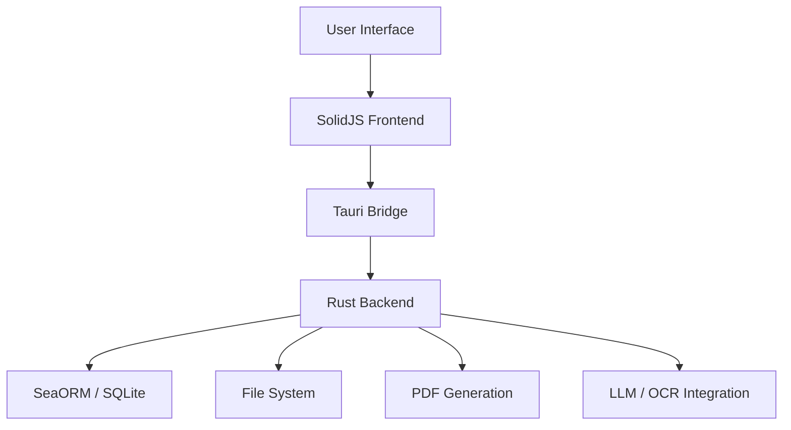
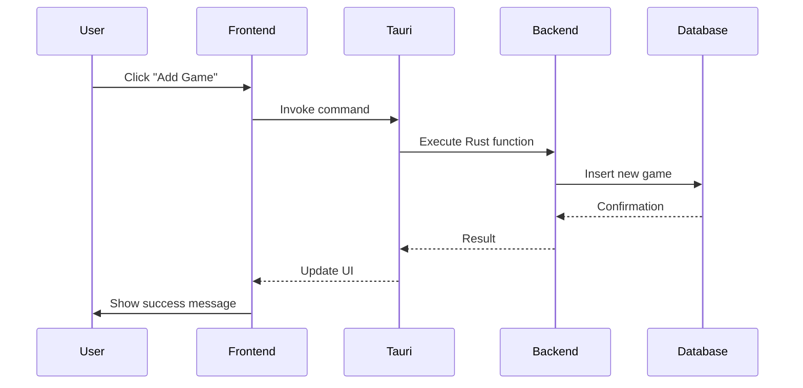

# Technical Architecture

## Overview

Games Keeper is a desktop application built with [Tauri 2.0](https://tauri.app/v2/), [SolidJS](https://www.solidjs.com/), and [SQLite](https://www.sqlite.org/) via [SeaORM](https://www.sea-ql.org/SeaORM/).

## System Components

### Frontend (SolidJS)
- Responsible for rendering the UI
- Manages application state
- Communicates with backend via Tauri IPC

### Backend (Rust)
- Handles business logic
- Manages database operations
- Provides file system access
- Performs heavy computations (PDF generation, etc.)

### Database (SQLite)
- Single file (`collection.db`) for portability
- Accessed via SeaORM ORM
- Schema versioned with migrations

## Data Flow

## Security Considerations

- All file system access is restricted to allowed directories
- Database queries use parameterized statements to prevent SQL injection
- No network calls are made without explicit user consent (for LLM/OSS features)