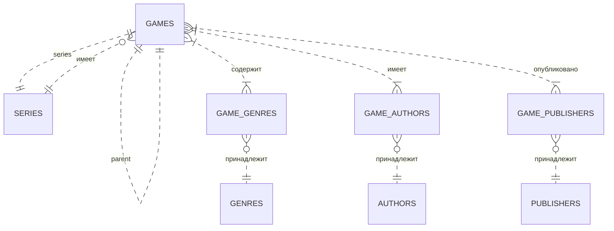

# Схема базы данных

## Обзор

Games Keeper использует SQLite в качестве базы данных, управляемой через SeaORM. Схема разработана для гибкости и расширяемости.

## Таблицы

### games
Хранит все элементы коллекции (игры, дополнения, промо, пользовательские элементы).

| Колонка | Тип | Описание |
|---------|-----|----------|
| id | INTEGER PRIMARY KEY AUTOINCREMENT | Уникальный идентификатор |
| parent_id | INTEGER REFERENCES games(id) | Родительский элемент (для дополнений и т.п.) |
| series_id | INTEGER REFERENCES series(id) | Серия, к которой относится этот элемент |
| node_type | TEXT NOT NULL | Тип: 'game', 'expansion', 'promo', 'custom' |
| sort_order | INTEGER DEFAULT 0 | Порядок среди братьев и сестер |
| title | TEXT NOT NULL | Основное название |
| original_title | TEXT | Название на оригинальном языке |
| description | TEXT | Подробное описание |
| release_year | INTEGER | Год выпуска |
| min_players | INTEGER | Минимальное количество игроков |
| max_players | INTEGER | Максимальное количество игроков |
| play_time | INTEGER | Среднее время игры в минутах |
| min_age | INTEGER | Минимальный возраст |
| image_path | TEXT | Путь к изображению обложки |
| created_at | DATETIME DEFAULT CURRENT_TIMESTAMP | Время создания |
| updated_at | DATETIME DEFAULT CURRENT_TIMESTAMP | Время последнего обновления |
| metadata | JSON | Гибкое JSON поле для дополнительных данных |

### Жанры, Авторы, Издатели, Серии

Эти таблицы поддерживают нормализацию и ссылаются из таблицы games через промежуточные таблицы.

#### genres
| Колонка | Тип |
|---------|-----|
| id | INTEGER PRIMARY KEY |
| name | TEXT NOT NULL UNIQUE |

#### game_genres (промежуточная)
| Колонка | Тип |
|---------|-----|
| game_id | INTEGER REFERENCES games(id) |
| genre_id | INTEGER REFERENCES genres(id) |

Аналогичная структура существует для авторов, издателей и серий.

## Расширяемость

Поле `metadata` типа JSON позволяет хранить произвольные данные без изменения схемы. Будущие версии могут внедрить формальную систему схем для пользовательских полей.

## Индексы

- Первичные ключи на всех колонках `id`
- Индексы внешних ключей
- Индекс на колонке `title` для поиска
- Индекс на колонке `node_type` для фильтрации

## Миграции схемы

Миграции управляются через систему миграций SeaORM. См. файлы в `src-tauri/migrations/`.

## Пример ER-диаграммы

## Примечания

- Все метки времени хранятся в UTC и конвертируются в местное время в интерфейсе.
- Поле `metadata` проиндексировано для эффективного запроса в SQLite (с использованием расширения JSON1).